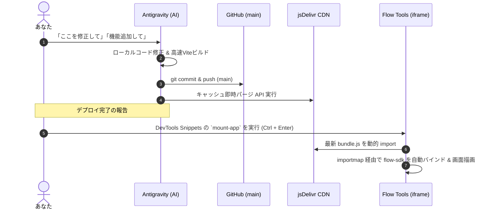

# Google Flow Tools 連携マニュアル & 将来のスリム化設計書

本ドキュメントは、Google Flow Tools（プレビュー iframe 環境）上でローカル React アプリケーションを直接マウント・実行する仕組みの運用手順書、および将来的に外部バンドルを使わず Flow Tools 単体コードへ移行するための「コード削減・スリム化方針」をまとめたものです。

---

## 第1部：現在の実行・開発フロー（完全自動化パイプライン）

### 1. 初回準備：Chrome DevTools Snippets の設定

Flow Tools のプレビュー iframe は再読み込みやプロジェクト切り替え時に画面が初期化されるため、DevTools の **Snippets（スニペット）機能** にマウントコードを保存しておくと、**右クリック「Run」（または `Ctrl + Enter`）一発で起動** できます。

#### 手順：
1. Flow Tools のプレビュー画面（黒い画面エリア）を右クリックして **「検証（Inspect）」** を開く。
2. DevTools 上部の **「Sources（ソース）」** タブを選択。
3. 左側ペインの **「Snippets」**（見当たらない場合は `>>` をクリック）を選択。
4. **「+ New snippet」** をクリックし、名前に `mount-app` と入力。
5. エディタ部分に以下のコードを貼り付けて保存（`Ctrl + S`）：

```javascript
// 1. 古い画面をクリア
const root = document.getElementById('root') || document.body;
root.innerHTML = '';

// 2. GitHub Rawから最新コードを0秒直取得して動的マウント
fetch(`https://raw.githubusercontent.com/kuiswin/flowtoolhuck/main/dist/bundle.js?t=${Date.now()}`)
  .then(r => {
    if (!r.ok) throw new Error('GitHubからの取得エラー: ' + r.status);
    return r.text();
  })
  .then(code => {
    const blob = new Blob([code], { type: 'application/javascript' });
    return import(URL.createObjectURL(blob));
  })
  .then(m => {
    m.mount(root);
    console.log("🚀 STUDIO PRO (完全最新版) をマウントしました！");
  })
  .catch(err => console.error("マウントエラー:", err));
```

---

### 2. 日常の運用フロー

今後の開発・修正は以下の 2 ステップだけで完結します：



- **Flow Tools 側の「コード」タブやチャットAIを触る必要は一切ありません**。
- `?t=${Date.now()}` によりブラウザキャッシュは常に無効化され、常に最新のコードが反映されます。

---

## 第2部：将来「Flow Tools 単一ファイルのみ」で動かすためのスリム化分析

Flow Tools 組み込みのコードエディタは「単一ファイル（1ファイル）強制」であり、チャットAIのトークン数制限やコード検閲（複雑すぎるコードの拒否）を回避するには、**「コード行数を極限まで削り、LLMネイティブな設計にする」** ことが鍵となります。

現在のコードベースを単一ファイル（400〜500行以内）に圧縮するための **「ここをなくす・変えるだけでごっそり短くなる」** 4大ポイントを以下にまとめます。

---

### 1. 【最大削減：約650行削減】ブラウザ内動画生成（`mediabunny`）を全廃し、Flowネイティブ動画生成に一本化する

- **現状の重い箇所**:
  - `services/browserVideoService.ts`（約300行）
  - `services/exportService.ts` の Canvas ムービーレンダリング処理（約350行）
  - WebCodecs / mediabunny を使ったブラウザ内での動画フレーム合成・Ken Burns アニメーション・MP4 エンコード。
- **スリム化のアプローチ**:
  - Flow Tools にはネイティブで強力な動画生成 AI（`Flow.generate.video`）が備わっています。
  - ブラウザ側で泥臭く Canvas を回して MP4 を自作するロジックを全廃し、**「動画化はすべて `Flow.generate.video` に任せる」** 構成に統一します。
  - **効果**: `mediabunny` 依存が消え、複雑な Canvas レンダリングループ・アニメーション数学計算・エンコード処理（約650行）が **まるごと消滅** します。

---

### 2. 【大幅削減：約300行削減】ハードコードされた時代考証辞書を全廃し、「LLMプロンプト」に丸投げする

- **現状の重い箇所**:
  - `constants.ts` および `services/directorService.ts`（計約400行）
  - 江戸・明治・大正・昭和・現代の衣装、不適合要素（スマホ、時計、洋服などの禁止ワード集）が大量の JavaScript オブジェクトとして手書きされています。
- **スリム化のアプローチ**:
  - Flow Tools の裏には高性能 LLM（`Flow.generate.text`）がいます。
  - 人間が辞書を書くのをやめ、ディレクターAIへのプロンプトに **「この時代に存在してはならない現代小道具（NG要素）と、正しい衣装の英語プロンプトを考証してJSONで出力せよ」** と 1 行書くだけにします。
  - **効果**: 辞書データと考証ロジックが 0 行になり、**プロンプト呼び出し 1 つ（十数行）に圧縮** されます。対応できる時代も無限に広がります。

---

### 3. 【中規模削減：約250行削減】ZIPエクスポート（`jszip`）を廃止し、個別ダウンロードまたはクリップボードコピーにする

- **現状の重い箇所**:
  - `services/exportService.ts` の `jszip` 構築・Blob 変換・階層フォルダ生成ロジック（約250行）。
- **スリム化のアプローチ**:
  - 完成した台本や設定は「ワンクリックで JSON / Markdown をクリップボードにコピー」または「テキストファイル 1 本保存」に簡素化。
  - 画像や動画の保存は Flow 標準の `Flow.download()` またはブラウザの `<a download>` を直接叩く。
  - **効果**: `jszip` のインポートと Base64 再エンコード処理が不要になり、ダウンロード関数が **わずか 5 行** になります。

---

### 4. 【小規模削減：約100行削減】手書き IndexedDB を `localStorage` または React State のみにする

- **現状の重い箇所**:
  - `services/db.ts`（約150行）の IndexedDB トランザクション・スキーマ定義・Cursor 走査。
- **スリム化のアプローチ**:
  - 生成データ（台本や画像URL）の永続化は、ブラウザ標準の `localStorage.setItem('flow_studio', JSON.stringify(data))` で十分。
  - **効果**: DB の初期化待ちや非同期ハンドリングがなくなり、**5行のヘルパー関数** に置き換わります。

---

### まとめ：単一ファイル化した場合の想定コード規模

| モジュール | 現状の行数 | スリム化後の行数 | 削減理由・方法 |
| :--- | :--- | :--- | :--- |
| **動画生成・合成** | 約 650 行 | **0 行** | `Flow.generate.video` に全委託、mediabunny 廃止 |
| **時代考証・プロンプト辞書** | 約 400 行 | **約 20 行** | 手動辞書を全廃し、Gemini（Flow.generate.text）に考証させる |
| **エクスポート（ZIP）** | 約 250 行 | **約 10 行** | 個別ダウンロード & クリップボードコピー化 |
| **データベース（IndexedDB）**| 約 150 行 | **約 10 行** | `localStorage` に統一 |
| **UIコンポーネント群** | 約 1,200 行 | **約 250 行** | 共通プリミティブの簡素化、単一ファイル内の関数コンポーネント化 |
| **合計** | **約 2,650 行** | **約 300〜400 行** | **単一ファイルで Flow Tools のエディタに直接収まる規模へ** |

まずは現在の「ローカルマルチファイル開発 ＋ GitHub / jsDelivr 経由の即時マウント」で機能や UI を自由に作り込み、仕様が固まった段階で上記の 4 大ポイントに沿って単一ファイルへ凝縮するのが最も効率的で失敗のないロードマップです。
